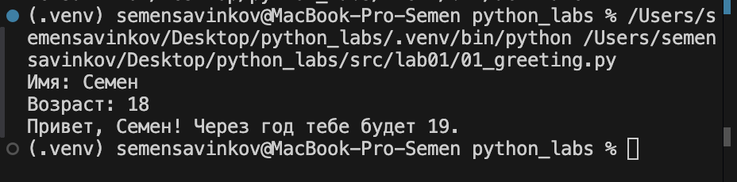
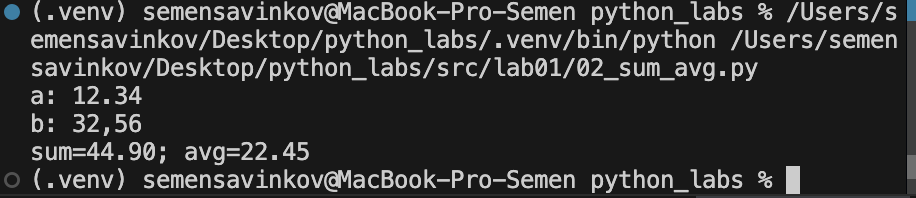
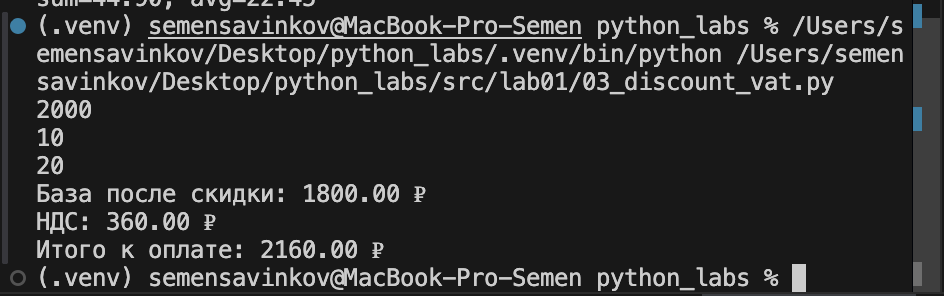
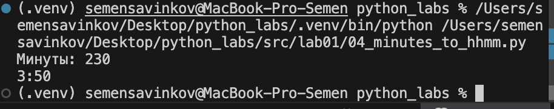
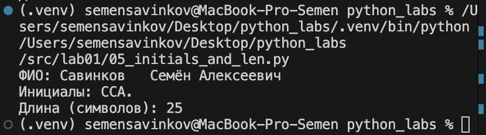
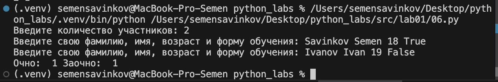

# python_labs

## Лабораторная работа 1

### Задание 1

```python
name = input("Имя: ")
age = int(input("Возраст: "))
print(f"Привет, {name}! Через год тебе будет {age + 1}.")
```


### Задание 2

```python
a = float(input("a: ").replace(",", "."))
b = float(input("b: ").replace(",", "."))

s = a + b
avg = s / 2

print(f"sum={s:.2f}; avg={avg:.2f}")
```


### Задание 3

```python
price = float(input())
discount = float(input())
vat = float(input())

base = price * (1 - discount/100)
vat_amount = base * (vat/100)
total = base + vat_amount

print(f"База после скидки: {base:.2f} ₽")
print(f"НДС: {vat_amount:.2f} ₽")
print(f"Итого к оплате: {total:.2f} ₽")
```


### Задание 4

```python
def minutes_to_hhmm(m):
    hours = m // 60
    remaining_minutes = m % 60
    return f"{hours}:{remaining_minutes:02d}"

m = int(input("Минуты: "))
result = minutes_to_hhmm(m)
print(f"{result}")
```


### Задание 5

```python
fio = input("ФИО: ")
fio_clean = " ".join(fio.split())
parts = fio_clean.split()
initials = "".join([p[0].upper() for p in parts]) + "."

print(f"Инициалы: {initials}")
print(f"Длина (символов): {len(fio_clean)}")
```


### Задание 6

```python
n = int(input('Введите количество участников: '))  
ochno = 0  
zaochno = 0
for i in range(n):
    fam, name, age, form = input('Введите свою фамилию, имя, возраст и форму обучения: ').split()
    if form=="True":
        ochno += 1
    else:
        zaochno += 1
print('Очно: ',ochno, 'Заочно: ', zaochno)
```


