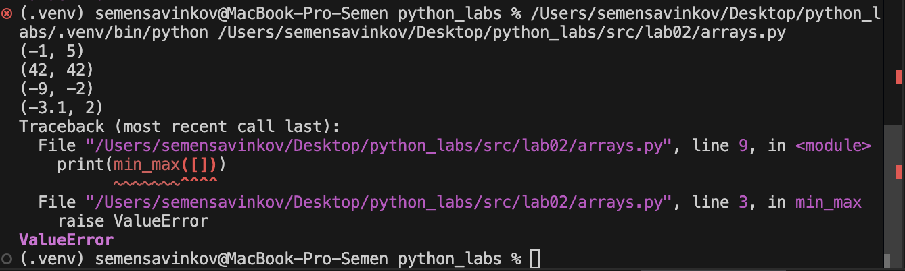
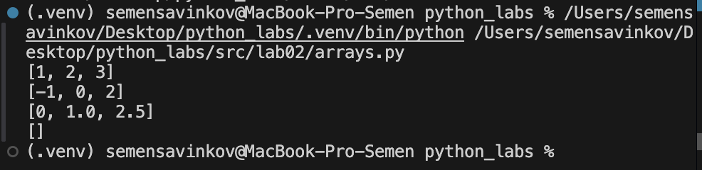
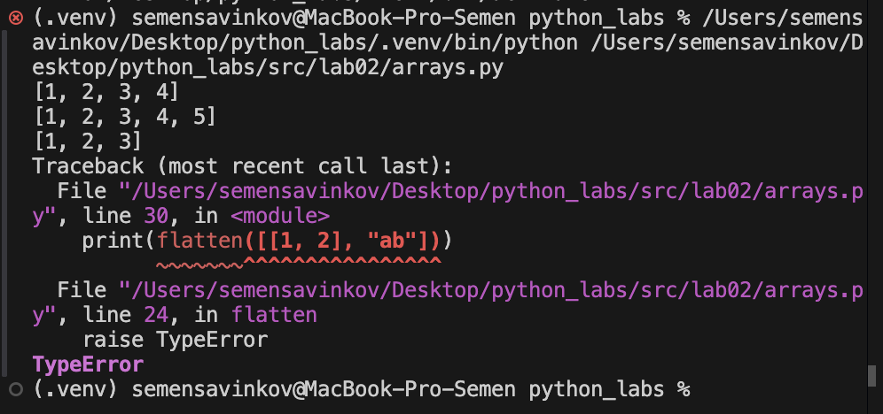
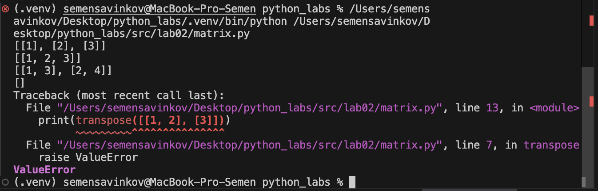
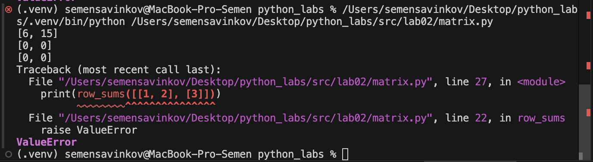
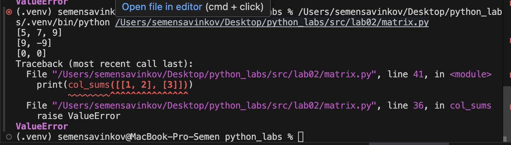
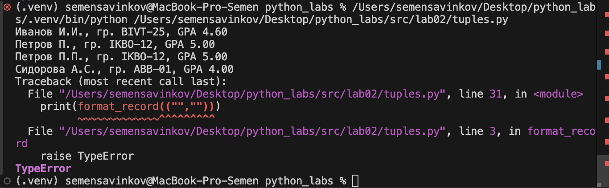

# python_labs

## Лабораторная работа 1

### Задание 1

```python
name = input("Имя: ")
age = int(input("Возраст: "))
print(f"Привет, {name}! Через год тебе будет {age + 1}.")
```


### Задание 2

```python
a = float(input("a: ").replace(",", "."))
b = float(input("b: ").replace(",", "."))

s = a + b
avg = s / 2

print(f"sum={s:.2f}; avg={avg:.2f}")
```


### Задание 3

```python
price = float(input())
discount = float(input())
vat = float(input())

base = price * (1 - discount/100)
vat_amount = base * (vat/100)
total = base + vat_amount

print(f"База после скидки: {base:.2f} ₽")
print(f"НДС: {vat_amount:.2f} ₽")
print(f"Итого к оплате: {total:.2f} ₽")
```


### Задание 4

```python
def minutes_to_hhmm(m):
    hours = m // 60
    remaining_minutes = m % 60
    return f"{hours}:{remaining_minutes:02d}"

m = int(input("Минуты: "))
result = minutes_to_hhmm(m)
print(f"{result}")
```


### Задание 5

```python
fio = input("ФИО: ")
fio_clean = " ".join(fio.split())
parts = fio_clean.split()
initials = "".join([p[0].upper() for p in parts]) + "."

print(f"Инициалы: {initials}")
print(f"Длина (символов): {len(fio_clean)}")
```


### Задание 6

```python
n = int(input('Введите количество участников: '))  
ochno = 0  
zaochno = 0
for i in range(n):
    fam, name, age, form = input('Введите свою фамилию, имя, возраст и форму обучения: ').split()
    if form=="True":
        ochno += 1
    else:
        zaochno += 1
print('Очно: ',ochno, 'Заочно: ', zaochno)
```


## Лабораторная работа 2

### Задание 1 (min_max)

```python
def min_max(nums: list[float | int]) -> tuple[float | int, float | int]:
    if not nums:
        raise ValueError
    return (min(nums), max(nums))
print(min_max([3, -1, 5, 5, 0]))
print(min_max([42]))
print(min_max([-5, -2, -9]))
print(min_max([1.5, 2, 2.0, -3.1]))
print(min_max([]))
```


### Задание 1 (unique sorted)

```python 
def unique_sorted(nums: list[float | int]) -> list[float | int]:
     return sorted(set(nums))
print(unique_sorted([3, 1, 2, 1, 3]))
print(unique_sorted([-1, -1, 0, 2, 2]))
print(unique_sorted([1.0, 1, 2.5, 2.5, 0]))
print(unique_sorted([]))
```


### Задание 1 (flatten)

```python
def flatten(mat: list[list | tuple]) -> list:
     flat = []
     for row in mat:
         if not isinstance(row, (list, tuple)):
             raise TypeError
         flat.extend(row)
     return flat
print(flatten([[1, 2], [3, 4]]))
print(flatten([[1, 2], (3, 4, 5)]))
print(flatten([[1], [], [2, 3]]))
print(flatten([[1, 2], "ab"]))
```


### Задание 2 (transpose)

```python
def transpose(mat: list[list[float | int]]) -> list[list]:
    if not mat:
        return []
    row_len = len(mat[0])
    for row in mat:
        if len(row) != row_len:
            raise ValueError
    return [[mat[r][c] for r in range(len(mat))] for c in range(row_len)]
print(transpose([[1, 2, 3]]))
print(transpose([[1], [2], [3]]))
print(transpose([[1, 2], [3, 4]]))
print(transpose([]))
print(transpose([[1, 2], [3]]))
```


### Задание 2 (row_sums)

```python
def row_sums(mat: list[list[float | int]]) -> list[float]:
    if not mat:
        return []
    row_len = len(mat[0])
    for row in mat:
        if len(row) != row_len:
            raise ValueError
    return [sum(row) for row in mat]
print(row_sums([[1, 2, 3], [4, 5, 6]]))
print(row_sums([[-1, 1], [10, -10]]))
print(row_sums([[0, 0], [0, 0]]))
print(row_sums([[1, 2], [3]]))
```


### Задание 2 (col_sums)

```python
def col_sums(mat: list[list[float | int]]) -> list[float]:
    if not mat:
        return []
    row_len = len(mat[0])
    for row in mat:
        if len(row) != row_len:
            raise ValueError
    return [sum(row[c] for row in mat) for c in range(row_len)]
print(col_sums([[1, 2, 3], [4, 5, 6]]))
print(col_sums([[-1, 1], [10, -10]]))
print(col_sums([[0, 0], [0, 0]]))
print(col_sums([[1, 2], [3]]))
```


### Задание 3

```python
def format_record(rec: tuple[str, str, float]) -> str:
    if not isinstance(rec, tuple) or len(rec) != 3:
        raise TypeError

    fio, group, gpa = rec

    if not isinstance(fio, str) or not isinstance(group, str):
        raise TypeError
    if not isinstance(gpa, (int, float)):
        raise TypeError

    fio = " ".join(fio.strip().split())
    group = group.strip()
    if not fio or not group:
        raise ValueError

    parts = fio.split()
    if len(parts) < 2 or len(parts) > 3:
        raise ValueError

    surname = parts[0].capitalize()
    initials = "".join(p[0].upper() + "." for p in parts[1:])

    gpa_str = f"{gpa:.2f}"

    return f"{surname} {initials}, гр. {group}, GPA {gpa_str}"
print(format_record(("Иванов Иван Иванович", "BIVT-25", 4.6)))
print(format_record(("Петров Пётр", "IKBO-12", 5.0)))
print(format_record(("Петров Пётр Петрович", "IKBO-12", 5.0)))
print(format_record(("  сидорова  анна   сергеевна ", "ABB-01", 3.999)))
print(format_record(("","")))
```
