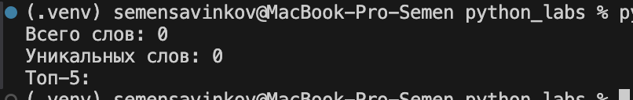

# Лабораторная работа №4 — Файлы: TXT/CSV и отчёты по текстовой статистике

## Задание A — модуль `src/lab04/io_txt_csv.py`

```python
from pathlib import Path
import csv
from typing import Iterable, Sequence


def read_text(path: str | Path, encoding: str = "utf-8") -> str:
    p = Path(path)
    return p.read_text(encoding=encoding)


def write_csv(
    rows: Iterable[Sequence],
    path: str | Path,
    header: tuple[str, ...] | None = None,
) -> None:
    
    p = Path(path)
    rows = list(rows)
    if rows and len({len(r) for r in rows}) != 1:
        raise ValueError("Все строки должны иметь одинаковую длину")

    with p.open("w", newline="", encoding="utf-8") as f:
        writer = csv.writer(f)
        if header:
            writer.writerow(header)
        for r in rows:
            writer.writerow(r)
```

## Тест io_txt_csv (+ краевые случаи)

```python
from pathlib import Path
from collections import Counter
from src.lab04.io_txt_csv import read_text, write_csv
from src.lib.text import normalize, tokenize, top_n

DATA_DIR = Path("data/lab04")
DATA_DIR.mkdir(parents=True, exist_ok=True)

#Пустой файл
empty_file = DATA_DIR / "empty.txt"
empty_file.write_text("")
text = read_text(empty_file)
tokens = tokenize(normalize(text))
freq = Counter(tokens)

report_empty_csv = DATA_DIR / "report_empty.csv"
write_csv(sorted(freq.items(), key=lambda x: (-x[1], x[0])),
          report_empty_csv, header=("word", "count"))

print("Пустой файл:")
print(f"Всего слов: {len(tokens)}")
print(f"Уникальных слов: {len(freq)}")
print(f"CSV создан: {report_empty_csv}\n")

#Пустой список rows, header=None
empty_csv_file = DATA_DIR / "check_empty.csv"
write_csv([], empty_csv_file)
print("Пустой список rows, header=None:")
print(f"CSV создан: {empty_csv_file} (0 строк)\n")

#Пустой список rows, с заголовком
header_only_csv = DATA_DIR / "check_header.csv"
write_csv([], header_only_csv, header=("a", "b"))
print("Пустой список rows, с заголовком:")
print(f"CSV создан: {header_only_csv} (только заголовок)\n")

#Большой файл
big_file = DATA_DIR / "big.txt"
big_text = "слово " * 1000000 
big_file.write_text(big_text)

tokens_big = tokenize(normalize(read_text(big_file)))
freq_big = Counter(tokens_big)

report_big_csv = DATA_DIR / "report_big.csv"
write_csv(sorted(freq_big.items(), key=lambda x: (-x[1], x[0])),
          report_big_csv, header=("word", "count"))

print("Большой файл:")
print(f"Всего слов: {len(tokens_big)}")
print(f"Уникальных слов: {len(freq_big)}")
print(f"CSV создан: {report_big_csv}\n")

# Проверка top_n
print("Топ-5 слов из большого файла:")
for word, count in top_n(freq_big, 5):
    print(f"{word}: {count}")
```
## Итог:


## Тест-кейсы 

## A. Один файл (база)

#### Вход: (`data/input.txt`):


#### Итог: `report.csv`:


#### Консоль:


## B. Пустой файл

#### Вход: пустой (`data/input.txt`):


#### Итог: `report.csv` содержит только заголовок:


#### Консоль:



## C. Кодировка cp1251

#### Вход: (`data/input.txt`) в cp1251 с текстом Привет:


**Действие:** `python src/lab04/text_report.py --in data/input.txt --encoding cp1251`  

#### Итог: `report.csv`:


#### Консоль:

