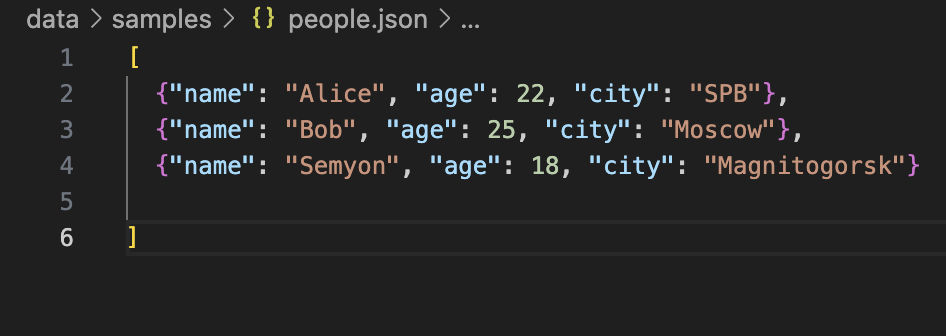
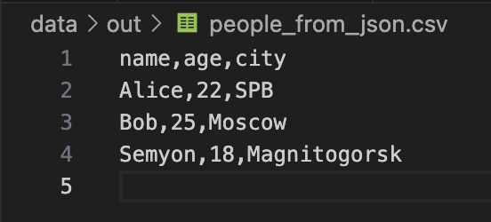
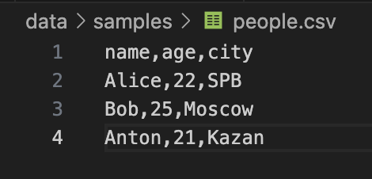
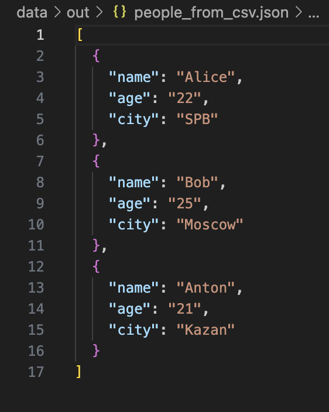
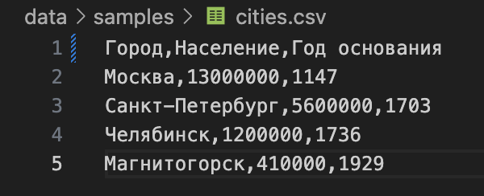
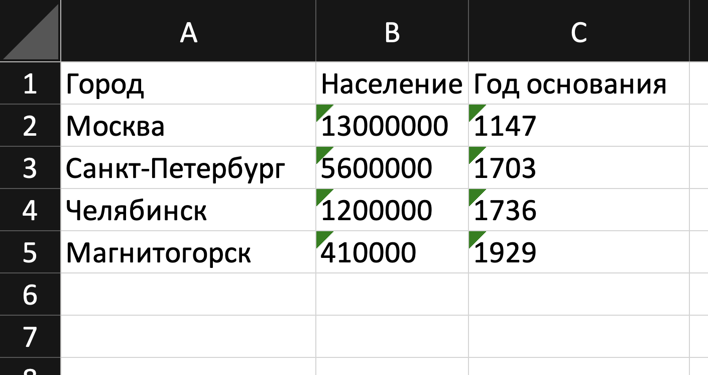

# Лабораторная работа №5 — JSON и конвертации (JSON↔CSV, CSV→XLSX)

## Задание A — JSON ↔ CSV

```python
import json
import csv
from pathlib import Path

def json_to_csv(json_path: str, csv_path: str) -> None:
    """
    Преобразует JSON-файл в CSV.
    Поддерживает список словарей [{...}, {...}], заполняет отсутствующие поля пустыми строками.
    Кодировка UTF-8. Порядок колонок — как в первом объекте или алфавитный (указать в README).
    """
    jpath, cpath = Path(json_path), Path(csv_path)
    if not jpath.exists():
        raise FileNotFoundError(jpath)
    if jpath.suffix != ".json" or cpath.suffix != ".csv":
        raise ValueError

    with jpath.open(encoding="utf-8") as jf:
        data = json.load(jf)

    if not isinstance(data, list) or not data or not all(isinstance(x, dict) for x in data):
        raise ValueError
    
    keys = []
    for d in data:
        for k in d:
            if k not in keys:
                keys.append(k)

    with cpath.open("w", encoding="utf-8", newline="") as cf:
        writer = csv.DictWriter(cf, fieldnames=keys)
        writer.writeheader()
        for row in data:
            writer.writerow({k: row.get(k, "") for k in keys})

def csv_to_json(csv_path: str, json_path: str) -> None:
    """
    Преобразует CSV в JSON (список словарей).
    Заголовок обязателен, значения сохраняются как строки.
    json.dump(..., ensure_ascii=False, indent=2)
    """
    cpath, jpath = Path(csv_path), Path(json_path)
    if not cpath.exists():
        raise FileNotFoundError(cpath)
    if cpath.suffix != ".csv" or jpath.suffix != ".json":
        raise ValueError
    with cpath.open(encoding="utf-8", newline="") as cf:
        reader = csv.DictReader(cf)
        if not reader.fieldnames:
            raise ValueError
        data = list(reader)

    if not data:
        raise ValueError

    with jpath.open("w", encoding="utf-8") as jf:
        json.dump(data, jf, ensure_ascii=False, indent=2)
```

#### Вход: (`data/samples/people.json`):


#### Результат: (`data/out/people_from_json.csv`):


#### Вход: (`data/samples/people.csv`):


#### Результат: (`data/out/people_from_csv.json`):



## Задание B — CSV → XLSX

```python
import csv
from pathlib import Path
from openpyxl import Workbook
from openpyxl.utils import get_column_letter


def csv_to_xlsx(csv_path: str, xlsx_path: str) -> None:
    """
    Конвертирует CSV в XLSX.
    Использовать openpyxl ИЛИ xlsxwriter.
    Первая строка CSV — заголовок.
    Лист называется "Sheet1".
    Колонки — автоширина по длине текста (не менее 8 символов).
    """
    cpath, xpath = Path(csv_path), Path(xlsx_path)
    if not cpath.exists():
        raise FileNotFoundError(cpath)
    if cpath.suffix != ".csv" or xpath.suffix != ".xlsx":
        raise ValueError

    with cpath.open(encoding="utf-8", newline="") as f:
        rows = list(csv.reader(f))

    if not rows:
        raise ValueError

    wb, ws = Workbook(), Workbook().active
    wb = Workbook()
    ws = wb.active
    ws.title = "Sheet1"

    for r in rows:
        ws.append(r)

    for i, col in enumerate(ws.columns, 1):
        max_len = max(len(str(c.value or "")) for c in col)
        ws.column_dimensions[get_column_letter(i)].width = max(8, max_len)

    wb.save(xpath)
```

#### Вход: (`data/samples/cities.csv`):


#### Результат: (`data/out/cities.xlsx`):
