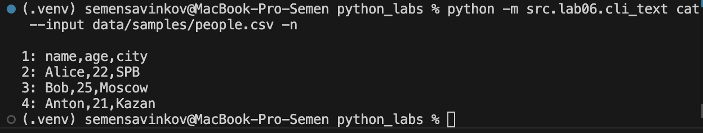
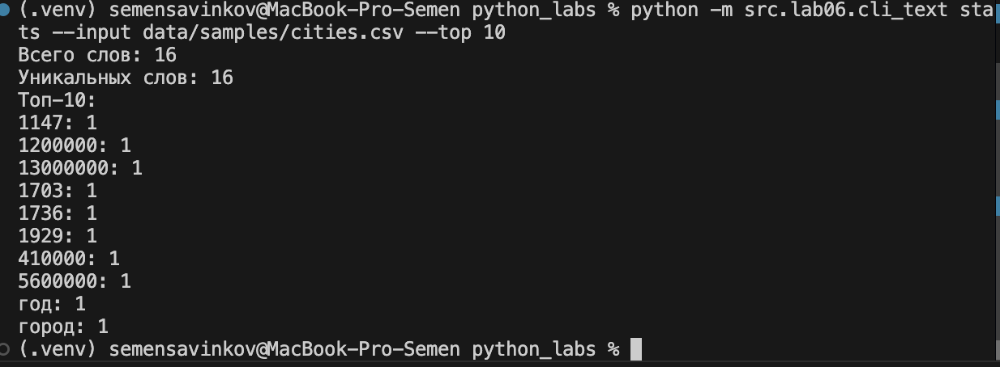
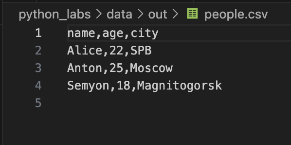
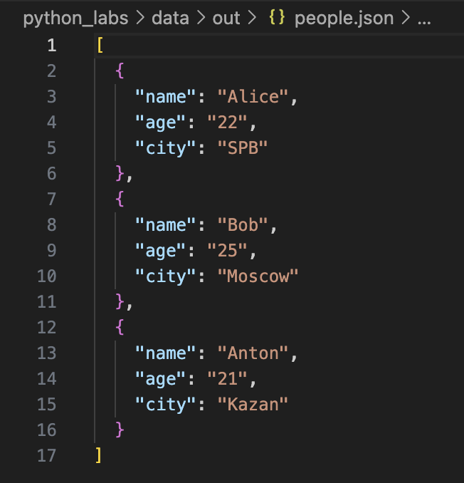
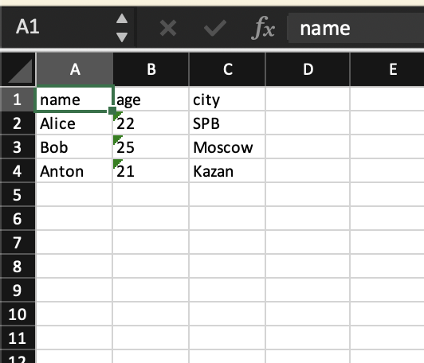
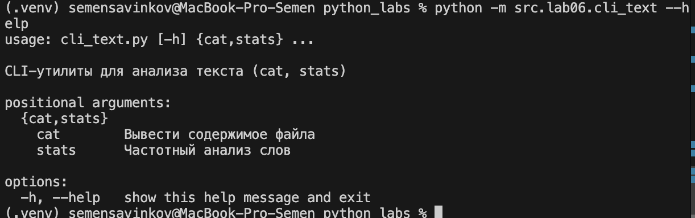

# ЛР6 — CLI‑утилиты с argparse (cat/grep‑lite + конвертеры): Техническое задание

## cli_text.py

```python
import argparse
from pathlib import Path
import sys
from src.lib.text import normalize, tokenize, count_freq, top_n


def cmd_cat(args):
    path = Path(args.input)
    if not path.exists():
        raise FileNotFoundError(f"Файл не найден: {path}")

    with path.open(encoding="utf-8") as f:
        for i, line in enumerate(f, 1):
            if args.n:
                print(f"{i}: {line.rstrip()}")
            else:
                print(line.rstrip())


def cmd_stats(args):
    path = Path(args.input)
    if not path.exists():
        raise FileNotFoundError(f"Файл не найден: {path}")

    text = path.read_text(encoding="utf-8")

    text_norm = normalize(text)
    tokens = tokenize(text_norm)
    freq = count_freq(tokens)

    top = top_n(freq, args.top)

    print(f"Всего слов: {len(tokens)}")
    print(f"Уникальных слов: {len(freq)}")
    print(f"Топ-{args.top}:")
    for w, c in top:
        print(f"{w}: {c}")


def build_parser():
    parser = argparse.ArgumentParser(
        description="CLI-утилиты для анализа текста (cat, stats)"
    )
    subparsers = parser.add_subparsers(dest="command", required=True)

    # ------------------ cat ------------------
    cat_p = subparsers.add_parser("cat", help="Вывести содержимое файла")
    cat_p.add_argument("--input", required=True, help="Путь к файлу")
    cat_p.add_argument("-n", action="store_true", help="Нумеровать строки")
    cat_p.set_defaults(func=cmd_cat)

    # ------------------ stats ------------------
    stats_p = subparsers.add_parser("stats", help="Частотный анализ слов")
    stats_p.add_argument("--input", required=True, help="Путь к текстовому файлу")
    stats_p.add_argument("--top", type=int, default=5, help="Сколько слов выводить (по умолчанию 5)")
    stats_p.set_defaults(func=cmd_stats)

    return parser


def main():
    parser = build_parser()
    args = parser.parse_args()

    try:
        args.func(args)
    except (FileNotFoundError, ValueError) as e:
        print(f"Ошибка: {e}", file=sys.stderr)
        sys.exit(1)


if __name__ == "__main__":
    main()
```

### Вывод с нумерацией:


### Вывод топ-10 слов:


## cli_convert.py

```python
import argparse
import sys
from pathlib import Path
from src.lab05.json_csv import json_to_csv, csv_to_json
from src.lab05.csv_xlsx import csv_to_xlsx


def cmd_json2csv(args):
    try:
        json_to_csv(args.input, args.output)
        print(f"Готово: {args.input} → {args.output}")
    except Exception as e:
        print(f"Ошибка: {e}", file=sys.stderr)
        sys.exit(1)


def cmd_csv2json(args):
    try:
        csv_to_json(args.input, args.output)
        print(f"Готово: {args.input} → {args.output}")
    except Exception as e:
        print(f"Ошибка: {e}", file=sys.stderr)
        sys.exit(1)


def cmd_csv2xlsx(args):
    try:
        csv_to_xlsx(args.input, args.output)
        print(f"Готово: {args.input} → {args.output}")
    except Exception as e:
        print(f"Ошибка: {e}", file=sys.stderr)
        sys.exit(1)


def build_parser():
    parser = argparse.ArgumentParser(
        description="CLI-конвертеры данных (JSON, CSV, XLSX)"
    )
    subparsers = parser.add_subparsers(dest="cmd", required=True)

    # json -> csv
    p1 = subparsers.add_parser("json2csv", help="Конвертировать JSON → CSV")
    p1.add_argument("--in", dest="input", required=True, help="Входной JSON-файл")
    p1.add_argument("--out", dest="output", required=True, help="Выходной CSV-файл")
    p1.set_defaults(func=cmd_json2csv)

    # csv -> json 
    p2 = subparsers.add_parser("csv2json", help="Конвертировать CSV → JSON")
    p2.add_argument("--in", dest="input", required=True, help="Входной CSV-файл")
    p2.add_argument("--out", dest="output", required=True, help="Выходной JSON-файл")
    p2.set_defaults(func=cmd_csv2json)

    # csv -> xlsx
    p3 = subparsers.add_parser("csv2xlsx", help="Конвертировать CSV → XLSX")
    p3.add_argument("--in", dest="input", required=True, help="Входной CSV-файл")
    p3.add_argument("--out", dest="output", required=True, help="Выходной XLSX-файл")
    p3.set_defaults(func=cmd_csv2xlsx)

    return parser


def main():
    parser = build_parser()
    args = parser.parse_args()
    args.func(args)

if __name__ == "__main__":
    main()
```

### Вывод JSON -> CSV:


### Вывод CSV -> JSON:


### Вывод CSV -> XLSX:


### Help:
