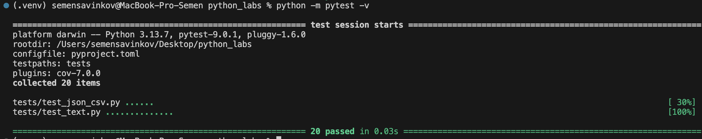
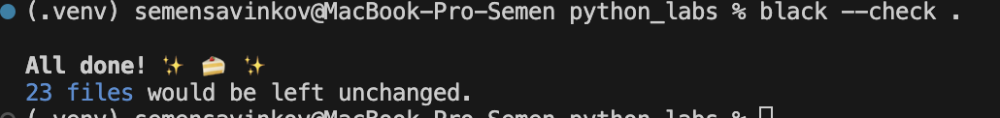

# ЛР7 — Тестирование: pytest + стиль (black)

## A. Тесты для `src/lib/text.py`

```python
import pytest
from src.lib.text import normalize, tokenize, count_freq, top_n


@pytest.mark.parametrize(
    "source, expected",
    [
        ("ПрИвЕт\nМИр\t", "привет мир"),
        ("ёжик, Ёлка", "ежик, елка"),
        ("Hello\r\nWorld", "hello world"),
        ("  двойные   пробелы  ", "двойные пробелы"),
        ("", ""),
        ("     ", ""),
    ],
)
def test_normalize(source, expected):
    assert normalize(source) == expected


@pytest.mark.parametrize(
    "source, expected",
    [
        ("привет мир", ["привет", "мир"]),
        ("hello,world!!!", ["hello", "world"]),
        ("по-настоящему круто", ["по-настоящему", "круто"]),
        ("2025 год", ["2025", "год"]),
        ("emoji 😀 не слово", ["emoji", "не", "слово"]),
        ("", []),
    ],
)
def test_tokenize(source, expected):
    assert tokenize(source) == expected


def test_count_freq_and_top_n():
    tokens = ["a", "b", "a", "c", "b", "a"]
    freq = count_freq(tokens)
    assert freq == {"a": 3, "b": 2, "c": 1}
    top = top_n(freq, 2)
    assert top == [("a", 3), ("b", 2)]


def test_top_n_tie_breaker():
    freq = {"apple": 2, "banana": 2, "cherry": 1}
    top = top_n(freq, 2)
    assert top == [("apple", 2), ("banana", 2)]
```

## B. Тесты для `src/lab05/json_csv.py`

```python
import pytest
import json
import csv
from pathlib import Path
from src.lab05.json_csv import json_to_csv, csv_to_json


def test_json_to_csv_roundtrip(tmp_path: Path):
    src = tmp_path / "people.json"
    dst = tmp_path / "people.csv"
    data = [
        {"name": "Alice", "age": 22},
        {"name": "Bob", "age": 25},
    ]
    src.write_text(json.dumps(data, ensure_ascii=False, indent=2), encoding="utf-8")
    json_to_csv(str(src), str(dst))

    with dst.open(encoding="utf-8") as f:
        rows = list(csv.DictReader(f))

    assert len(rows) == 2
    assert {"name", "age"} <= set(rows[0].keys())


def test_csv_to_json_roundtrip(tmp_path: Path):
    csv_file = tmp_path / "people.csv"
    json_file = tmp_path / "people.json"
    data = [
        {"name": "Alice", "age": "22"},
        {"name": "Bob", "age": "25"},
    ]
    with csv_file.open("w", encoding="utf-8", newline="") as f:
        writer = csv.DictWriter(f, fieldnames=["name", "age"])
        writer.writeheader()
        writer.writerows(data)

    csv_to_json(str(csv_file), str(json_file))

    with json_file.open(encoding="utf-8") as f:
        loaded = json.load(f)

    assert loaded == data


@pytest.mark.parametrize("bad_file", ["", "notjson.txt"])
def test_json_to_csv_invalid_file(tmp_path: Path, bad_file):
    path = tmp_path / bad_file
    with pytest.raises((ValueError, FileNotFoundError)):
        json_to_csv(str(path), str(tmp_path / "out.csv"))


@pytest.mark.parametrize("bad_file", ["", "notcsv.txt"])
def test_csv_to_json_invalid_file(tmp_path: Path, bad_file):
    path = tmp_path / bad_file
    with pytest.raises((ValueError, FileNotFoundError)):
        csv_to_json(str(path), str(tmp_path / "out.json"))
```

### Автотест



### Проверка форматирования black




