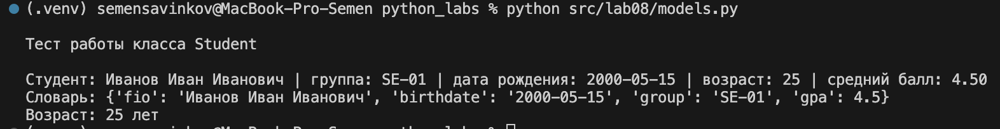
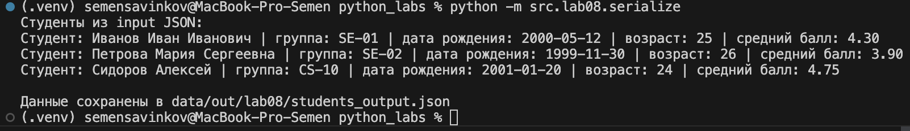

# ЛР8 – ООП в Python: `@dataclass Student`, методы и сериализация

## A. Реализовать класс `Student` (`models.py`)

```python
from dataclasses import dataclass, field
from datetime import datetime, date
from typing import Dict, Any


DATE_FORMAT = "%Y-%m-%d"


@dataclass
class Student:
    fio: str
    birthdate: str
    group: str
    gpa: float = field(default=0.0)

    def __post_init__(self):
        if not isinstance(self.fio, str) or not self.fio.strip():
            raise ValueError("Поле 'fio' должно быть непустой строкой")

        if not isinstance(self.birthdate, str):
            raise ValueError("Дата рождения должна быть строкой в формате YYYY-MM-DD")
        try:
            parsed = datetime.strptime(self.birthdate, DATE_FORMAT).date()
        except ValueError:
            raise ValueError(f"Дата рождения должна быть в формате {DATE_FORMAT} (например: 2001-12-31)")

        if parsed > date.today():
            raise ValueError("Дата рождения не может быть в будущем")
        
        try:
            gpa_value = float(self.gpa)
        except Exception:
            raise ValueError("Средний балл (gpa) должен быть числом")

        if not (0.0 <= gpa_value <= 5.0):
            raise ValueError("Средний балл (gpa) должен быть в диапазоне от 0 до 5")
        self.gpa = gpa_value

        if not isinstance(self.group, str) or not self.group.strip():
            raise ValueError("Поле 'group' должно быть непустой строкой")

    def age(self) -> int:

        birthday = datetime.strptime(self.birthdate, DATE_FORMAT).date()
        today = date.today()

        years = today.year - birthday.year
        if (today.month, today.day) < (birthday.month, birthday.day):
            years -= 1

        return years

    def to_dict(self) -> Dict[str, Any]:

        return {
            "fio": self.fio,
            "birthdate": self.birthdate,
            "group": self.group,
            "gpa": self.gpa,
        }

    @classmethod
    def from_dict(cls, d: Dict[str, Any]) -> "Student":

        if not isinstance(d, dict):
            raise TypeError("from_dict ожидает словарь")

        required = ["fio", "birthdate", "group", "gpa"]
        missing = [key for key in required if key not in d]

        if missing:
            raise KeyError(f"В словаре отсутствуют обязательные поля: {missing}")

        return cls(
            fio=d["fio"],
            birthdate=d["birthdate"],
            group=d["group"],
            gpa=d["gpa"],
        )

    def __str__(self) -> str:

        return (
            f"Студент: {self.fio} | группа: {self.group} | "
            f"дата рождения: {self.birthdate} | возраст: {self.age()} | средний балл: {self.gpa:.2f}"
        )

if __name__ == "__main__":

    print("\nТест работы класса Student\n")

    s = Student(
        fio="Иванов Иван Иванович",
        birthdate="2000-05-15",
        group="SE-01",
        gpa=4.5
    )

    print(s)
    print("Словарь:", s.to_dict())
    print("Возраст:", s.age(), "лет")
```



## B. Реализовать модуль `serialize.py`

```python
import json
from pathlib import Path
from .models import Student
from typing import List


def students_to_json(students: List[Student], path: str) -> None:
    data = [s.to_dict() for s in students]
    p = Path(path)
    p.parent.mkdir(parents=True, exist_ok=True)
    with p.open("w", encoding="utf-8") as f:
        json.dump(data, f, ensure_ascii=False, indent=2)


def students_from_json(path: str) -> List[Student]:
    p = Path(path)
    if not p.exists():
        raise FileNotFoundError(f"Файл '{path}' не найден")

    with p.open("r", encoding="utf-8") as f:
        data = json.load(f)

    if not isinstance(data, list):
        raise ValueError("JSON должен содержать список объектов")

    students = [Student.from_dict(item) for item in data]
    return students


if __name__ == "__main__":
    input_path = "data/lab08/students_input.json"
    output_path = "data/out/lab08/students_output.json"

    students = students_from_json(input_path)
    print("Студенты из input JSON:")
    for s in students:
        print(s)

    students_to_json(students, output_path)
    print(f"\nДанные сохранены в {output_path}")
```



