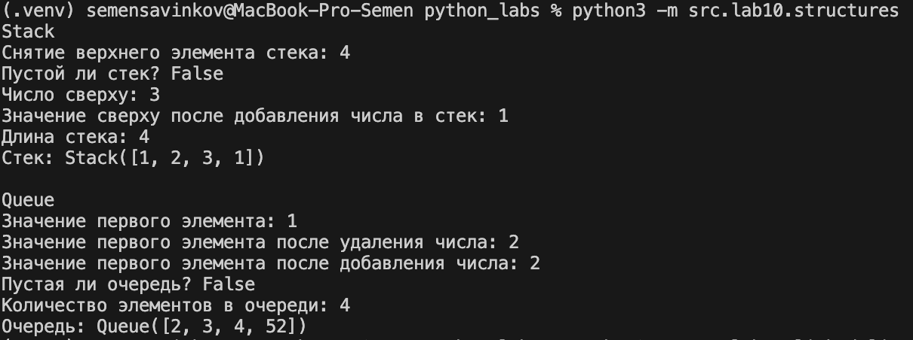
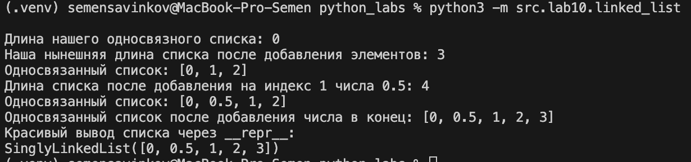

# ЛР10 — Структуры данных: Stack, Queue, Linked List и бенчмарки

## Теоретическая часть 

### Стек (Stack)
Стек — это структура данных, работающая по принципу LIFO (Last In, First Out) — последний добавленный элемент извлекается первым.

### Очередь (Queue)
Очередь — структура данных, работающая по принципу FIFO (First In, First Out) — первый добавленный элемент извлекается первым.

### Односвязный список (Singly Linked List)
Односвязный список — структура данных, состоящая из узлов, где каждый узел хранит:
- значение элемента
- ссылку на следующий узел

## A. Реализовать `Stack` и `Queue` (`src/lab10/structures.py`)

```python
from collections import deque
from typing import Any, Optional


class Stack:
    """Стек (LIFO) на базе list.

    Методы:
        push(item)      — O(1)
        pop()           — O(1)
        peek()          — O(1)
        is_empty()      — O(1)
        __len__()       — O(1)
    """

    __slots__ = ("_data",)

    def __init__(self, iterable=None) -> None:
        self._data: list[Any] = list(iterable) if iterable is not None else []

    def push(self, item: Any) -> None:
        self._data.append(item)

    def pop(self) -> Any:
        if not self._data:
            raise IndexError("Взятие элемента из пустого стека")
        return self._data.pop()

    def peek(self) -> Optional[Any]:
        return self._data[-1] if self._data else None

    def is_empty(self) -> bool:
        return not self._data

    def __len__(self) -> int:
        return len(self._data)

    def __repr__(self) -> str:
        return f"Stack({self._data!r})"


class Queue:
    """Очередь (FIFO) на базе collections.deque.

    Методы:
        enqueue(item)   — O(1)
        dequeue()       — O(1)
        peek()          — O(1)
        is_empty()      — O(1)
        __len__()       — O(1)
    """

    __slots__ = ("_data",)

    def __init__(self, iterable=None) -> None:
        self._data: deque[Any] = deque(iterable) if iterable is not None else deque()

    def enqueue(self, item: Any) -> None:
        self._data.append(item)

    def dequeue(self) -> Any:
        if not self._data:
            raise IndexError("Взятие элемента из пустой очереди")
        return self._data.popleft()

    def peek(self) -> Optional[Any]:
        return self._data[0] if self._data else None

    def is_empty(self) -> bool:
        return not self._data

    def __len__(self) -> int:
        return len(self._data)

    def __repr__(self) -> str:
        return f"Queue({list(self._data)!r})"
    
if __name__ == "__main__":
    print("Stack")

    stack = Stack([1, 2, 3, 4])
    print(f"Снятие верхнего элемента стека: {stack.pop()}")
    print(f"Пустой ли стек? {stack.is_empty()}")
    print(f"Число сверху: {stack.peek()}")
    stack.push(1)
    print(f"Значение сверху после добавления числа в стек: {stack.peek()}")
    print(f"Длина стека: {len(stack)}")
    print(f"Стек: {stack}")

    print("\nQueue")

    q = Queue([1, 2, 3, 4])
    print(f"Значение первого элемента: {q.peek()}")
    q.dequeue()
    print(f"Значение первого элемента после удаления числа: {q.peek()}")
    q.enqueue(52)
    print(f"Значение первого элемента после добавления числа: {q.peek()}")
    print(f"Пустая ли очередь? {q.is_empty()}")
    print(f"Количество элементов в очереди: {len(q)}")
    print(f"Очередь: {q}")
```



## B. Реализовать `SinglyLinkedList` (`src/lab10/linked_list.py`)

```python
from typing import Any, Iterator, Optional


class Node:

    __slots__ = ("value", "next")

    def __init__(self, value: Any, next: Optional["Node"] = None) -> None:
        self.value = value
        self.next = next

    def __repr__(self) -> str:
        return f"Node({self.value!r})"


class SinglyLinkedList:
    """Односвязный список.

    Методы:
        append(value)       — O(1)
        prepend(value)      — O(1)
        insert(idx, value)  — O(n)
        remove(value)       — O(n)
        __iter__(), __len__(), __repr__()
    """

    __slots__ = ("head", "tail", "_size")

    def __init__(self, iterable=None) -> None:
        self.head: Optional[Node] = None
        self.tail: Optional[Node] = None
        self._size: int = 0
        if iterable:
            for v in iterable:
                self.append(v)

    def append(self, value: Any) -> None:
        node = Node(value)
        if not self.head:
            self.head = node
            self.tail = node
        else:
            assert self.tail is not None
            self.tail.next = node
            self.tail = node
        self._size += 1

    def prepend(self, value: Any) -> None:
        node = Node(value, next=self.head)
        self.head = node
        if self._size == 0:
            self.tail = node
        self._size += 1

    def insert(self, idx: int, value: Any) -> None:
        if idx < 0 or idx > self._size:
            raise IndexError
        if idx == 0:
            self.prepend(value)
            return
        if idx == self._size:
            self.append(value)
            return

        prev = self.head
        for _ in range(idx - 1):
            assert prev is not None
            prev = prev.next
        node = Node(value, next=prev.next)
        prev.next = node
        self._size += 1

    def remove(self, value: Any) -> None:
        prev: Optional[Node] = None
        cur = self.head
        while cur:
            if cur.value == value:
                if prev is None:
                    self.head = cur.next
                else:
                    prev.next = cur.next
                if cur is self.tail:
                    self.tail = prev
                self._size -= 1
                return
            prev, cur = cur, cur.next
        raise ValueError

    def __iter__(self) -> Iterator[Any]:
        cur = self.head
        while cur:
            yield cur.value
            cur = cur.next

    def __len__(self) -> int:
        return self._size

    def __repr__(self) -> str:
        return f"SinglyLinkedList([{', '.join(repr(x) for x in self)}])"

if __name__ == "__main__":
    sll = SinglyLinkedList()
    print(f"Длина нашего односвязного списка: {len(sll)}")

    sll.append(1)
    sll.append(2)
    sll.prepend(0)
    print(f"Наша нынешняя длина списка после добавления элементов: {len(sll)}")
    print(f"Односвязанный список: {list(sll)}")

    sll.insert(1, 0.5)
    print(f"Длина списка после добавления на индекс 1 числа 0.5: {len(sll)}")
    print(f"Односвязанный список: {list(sll)}")

    sll.append(52)
    print(f"Односвязанный список после добавления числа в конец: {list(sll)}")

    print("Красивый вывод списка через __repr__:")
    print(sll)
```



### Выводы по бенчмаркам
Стек и очередь работают быстрее при добавлении и удалении элементов, так как операции выполняются напрямую на концах структуры.

Односвязный список медленнее при вставке или удалении элементов по позиции, потому что приходится проходить через элементы последовательно, чтобы найти нужное место.